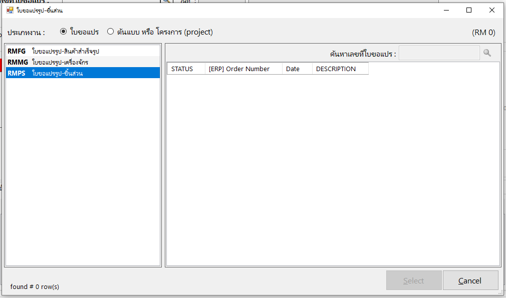

# SMART WORK17

## latest version **4.2.2.8**

### dated: **03-12-2020**

### Correct bug

- Remove the Requested Transfer Jobs (from ERP) which is not track for production but already have the ISSUE document (ERP) from the list of production request job.

ใบขอแปร
  

- sub-program crash during update 1

### Update

- item
- another items
+ item 
* item 

---

1. This is the list
2. 

### Add Feature

- Production sub-program

 